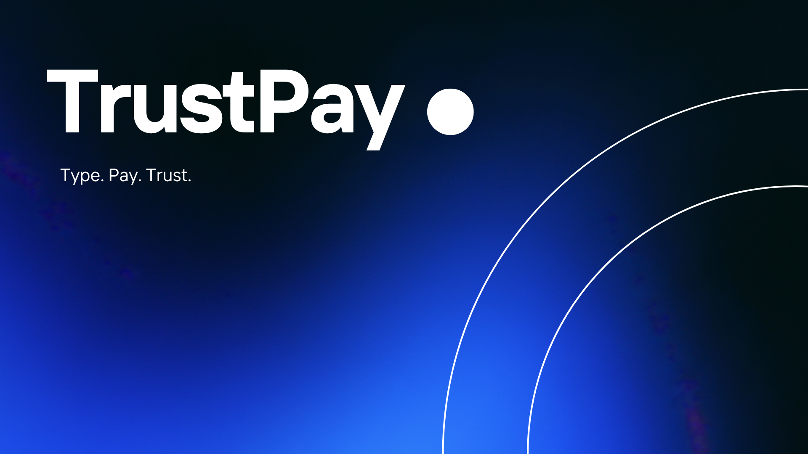

TrustPay is an AI-assisted blockchain payroll app built on Solana. It combines a Next.js frontend with an Anchor smart contract and a chat-based AI interface that helps users carry out payroll actions such as creating organizations, adding workers, funding treasuries, and processing salaries through wallet-signed transactions.

## About

This project was built to explore how payroll workflows can be handled on-chain in a simple and transparent way, while also showing how AI can make blockchain interactions easier through natural language commands.

## Features

- Create and manage payroll organizations
- Add workers and assign salaries
- Fund organization treasuries
- Process payroll on-chain
- Withdraw treasury funds
- Use an AI chat interface for supported actions
- Translate natural language prompts into payroll-related workflows

## Tech Stack

- Next.js and TypeScript
- Tailwind CSS
- Groq-powered chat interface
- Solana and Anchor
- Rust
- Solana Wallet Adapter

## Project Structure

```text
anchor/       Solana smart contract and tests
app/          Next.js application routes
components/   Reusable frontend components
lib/          Client-side helpers and integrations
services/     Blockchain interaction logic
utils/        Shared utility functions and types
```

## Local Setup

```bash
npm install

cd anchor
anchor build
anchor test

cd ..
npm run dev
```

The app runs locally at `http://localhost:3000`.
